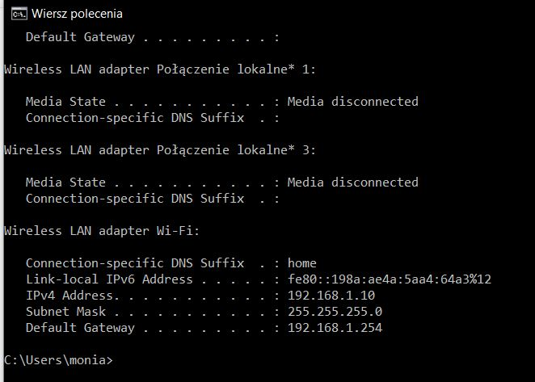
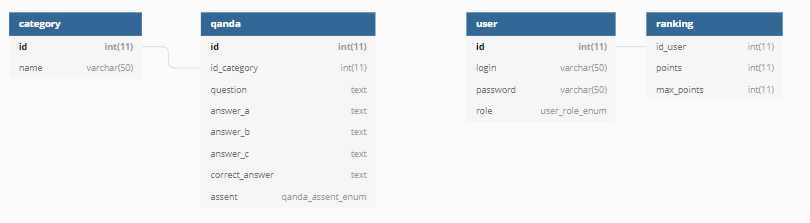

Autorzy aplikacji: Monika Leszniewska, Magdalena Słyk
# Aplikacja do rozwiązywania quizów "Quizomania"
Celem aplikacji jest umożliwenie użytkowniką rozwiązywania quizów oraz tworzenie ich dla siebie i innych. 


## Spis treści
1. [Technologie](README.md#technologie)
2. [Import bazy danych](README.md#import-bazy-danych)
   - [Baza danych w phpMyAdmin](README.md#baza-danych-w-phpmyadmin)
   - [Baza danych w MYSQL-Front](README.md#baza-danych-w-mysql-front)
3. [Uruchamianie aplikacji](README.md#uruchamianie-aplikacji)
   - [Korzystanie na komputerze](README.md#korzystanie-na-komputerze)
   - [Korzystanie na telefonie](README.md#korzystanie-na-telefonie)
4. [Sposób użycia](README.md#sposób-użycia)
   - [Diagramy przypadków użycia: użytkownik](README.md#diagramy-przypadków-użycia-użytkownik)
   - [Diagramy przypadków użycia: administrator](README.md#diagramy-przypadków-użycia-administrator)
5. [Struktura i opis katalogów aplikacji](README.md#struktura-i-opis-katalogów-aplikacji)
   - [Katalog: css](README.md#katalog-css)
   - [Katalog: dokumantacja](README.md#katalog-dokumentacja)
   - [Katalog: images](README.md#katalog-images)
   - [Katalog: js](README.md#katalog-js)
   - [Katalog: php](README.md#katalog-php)
   - [Katalog: style](README.md#katalog-style)
   - [Plik: index.php](README.md#plik-indexphp)
   - [Plik: baza końcowa.sql](README.md#baza-końcowasql)
   - [Plik: README.md](README.md#plik-readmemd)
6. [Struktura bazy danych](README.md#struktura-bazy-danych)
   - [Schemta bazy danych](README.md#schemat-bazy-danych)
   - [Tabela: category](README.md#tabela-category)
   - [Tabela: quanda](README.md#tabela-quanda)
   - [Tabela: ranking](README.md#tabela-ranking)
   - [Tabela: user](README.md#tabela-user)
7. [Struktura klas](README.md#struktura-klas)
   - [Klasa: DBConnection.php](README.md#dbconnectionphp)
   - [Klasa: Question.php](README.md#questionphp)
   - [Klasa: User.php](README.md#userphp)
   - [Klasa: Ranking.php](README.md#rankingphp)
8. [Nawigacja na stronie](README.md#nawigacja-na-stronie)
   - [Nawigacja podstawowa](README.md#nawigacja-podstawowa)
   - [Nawigacja użytkownika](README.md#nawigacja-użytkownika)
   - [Nawigacja administratora](README.md#nawigacja-administratora)
   - [Nawigacja na urządzeniach mobilnych](README.md#nawigacja-na-urządzeniach-mobilnych)
   - [Stopka](README.md#stopka)
9. [System rejestracji](README.md#system-rejestracji)   
10. [System logowania](README.md#system-logowania)
11. [System dodawania nowych pytań](README.md#system-dodawania-nowych-pytań)
12. [System akceptacji pytań przez administratora](README.md#system-akceptacji-pytań-przez-administratora)
13. [System wykonywania quizów](README.md#system-wykonywania-quizów)
14. [System rankingu](README.md#system-rankingu)
15. [Podstawowe zależności w wyglądzie](README.md#podstawowe-zależności-w-wyglądzie)
    - [Ogólna koncepcja wyglądu strony](README.md#ogólna-koncepcja-wyglądu-strony)
    - [Banner na stronie](README.md#banner-na-stronie)
    - [Przycisk zmieniający podświetlenie](README.md#przycisk-zmieniający-podświetlenie)
   
## Technologie
Do stworzenia oprogramowania wykorzstałyśmy skryptowy język PHP oraz hipertekstowy język znaczników HTML. Takie połączenie pozwala 
zaprojektować w pełni funkcjonalną stronę internetową. Składnia HTML pozwala opisać strukturę informacji zawartych wewnatrz strony nadając w
ten sposób odpowiednie znaczenie semantyczne odpowiednich kawałków kodu.
Język PHP pozwala na tworzenie skryptów po stronie serwera WWW, ale również może być używany do przetwarzania danych z poziomu wiersza poleceń.
Baza danych została utworzona w MySQL przy wykorzystaniu narzędzia phpMyAdmin,ponieważ w pełni współpracuje z językiem PHP.

Część graficzna została napisana w języku CSS,którego lista dyrektyw ustala w jaki sposób ma być wyświetlona przez przeglądarkę zwartość
wybranego elementu HTML.

#### Uwaga!! 
Aplikacja działa prawidłowo na przeglądarkach takich jak Firefox, Microsoft Edge oraz Internet Explorer. Korzystając z innych przeglądarek (na przykład Google Chrome) nie gwarantujemy poprawnego działania oraz odpowiedniego wyglądu aplikacji.  

#### Uwaga!!
Aplikacja działa tylko i wyłącznie w sieci lokalnej.

## Import bazy danych

#### Uwaga!!
Do prawnego działania aplikacji potrzebna jest dobrze zaimportowana baza danych.

Poniżej zosatnie przedstawione w jaki sposób prawidłowo zaimportować bazę danych przy użyciu phpMyAdmin oraz MySQL-Front. Przy używaniu aplikacji wstarczy korzystanie tylko z jednejo z powyżej podanych narzędzi, jednak dla ułątwienia zostanie pokazane jak dokonać importu na obu.

### Baza danych w phpMyAdmin
1. Uruchamiamy na komputerze Apache oraz MySQL (np. wykorzystując program XAMPP Control Panel).
   
   
 

2. Przechodzimy do narzędzi phpMyAdmin wpisując w pasku wyszukiwania przeglądarki `localhost/phpmyadmin/` (nie podajemy hasła root-a).

3. Tworzymy nową bazę danych o nazwie 'quiz'.
   
      


4. Do nowow utworzonej bazy importujemy bazę danych naszej aplikacji o nazwie 'baza końcowa'.
   
   

5. Po poprwanym wykonaniu działań powinniśmy otrzymać bazę danych o następującej strukturze.
   
   
   

**Teraz możemy zacząć korzystać z aplikacji.**

### Baza danych w MYSQL-Front
1. Uruchamiamy na komputerze Apache oraz MySQL (np. wykorzystując program XAMPP Control Panel).

2. Uruchamiamy MySQL-Front, a następnie w localhost dodajemy nową bazą danych nadając jej nazwę 'quiz'.
  
  

  

3. Przechodzimy do bazy 'quiz' i tam importujemy bazą danych aplikacji o nazwie 'baza końcowa'.
  
  

4. Po poprawnym wykonianiu czynności powinniśmy otrzymać bazę danych o następującej strukturze.
  
  

**Teraz możemy zacząć korzystać z aplikacji.**

## Uruchamianie aplikacji
### Korzystanie na komputerze
Do korzystanie z aplikacji na komputerze potrzebna jest poprawnie zaimportowana baza danych oraz uruchomiony Apache i MySQL.

Aby ruchomić aplikacje należy w przeglądarce internetowej wpisać następujący adres `localhost/Quizomania/index.php`.

### Korzystanie na telefonie
Do korzystanie z aplikacji na telefonie jest potrzebna zaimportowana na komputerze (z którym będziemy się łączyć) baza danych oraz uruchomiony Apache i MySQL.

Aby uruchomić aplikację potrzebujemy znać adres IPv4 Wi-Fi przez który będziemy się łączyć z bazą danych na komputerze (**PAMIĘTAJ:** telefon oraz komputer muszą być podłączone do tej samej sieci Wi-Fi).
Można to sprawdzić wykonując w wierszu poleceń PC komendę `ipconfig`.
 
 

W tym przykładzie adres IP Wi-Fi to 192.168.1.10.

Teraz znająć już adres IP możemy korzytsać z aplikacji na telefonie poprzez wpisanie w przeglądarce internetowej `[adres IP Wi-Fi]/Quizomania/index.php`. Wykorzystująć przykładowy adres IP, dostęp otrzymamy poprzez wpisane `192.168.1.10/Quizomania/index.php`.

## Sposób użycia
### Diagramy przypadków użycia: użytkownik


### Diagramy przypadków użycia: administrator


## Struktura i opis katalogów aplikacji


### Katalog: css
Katalog zwiera wszystkie pliki odpowiedzialne za wygląd strony, napisane w języku CSS. Więcej o tym katalogu zostało opisane w [Podstawowe zależności w wyglądzie](README.md#podstawowe-zależności-w-wyglądzie).
### Katalog: dokumentacja
Katalog przechowuje plik pdf, którego zawartość została wykorzystana podczas tworzenia dokumentacji. W podkatalagou *Przypadki użycia* znajduję się zdjęcia diagramów UML przypadków użycia. Pozostałe pliki to screeny katalogów programu oraz diagramów klas UML.
### Katalog: images
Przechowuje wszystkie zdjęcia wykorzystywane w aplikacji o rozrzerzeniach jpg. png. oraz svg. 
### Katalog: js
W tym katalogu znajduje się plik `main-navigation.js` napisany w języku JavaScrip, który odpowiada za wykonanie akcji po naciśnieciu na mobilny button podczas korzystania z aplikacji na telefonie. Powodując przeniesienie do mobilnej nawigacji w aplikacji. Krótki opis kodu znajduje się w punkcie [Nawigacja na urządzeniach mobilnych](README.md#nawigacja-na-urządzeniach-mobilnych)
### Katalog: php
Odpowiada za przechowywanie głównych plików projektu napisanych w języku PHP oraz HTML. W jego podkatalogu o nazwie `class` znajdują się klasy, które zostały utworzone do wykonywania akcji między bazą danych a aplikacją. W podpunkcie [Struktura klas](README.md#struktura-klas) zostały one dokładniej opisane.
### Katalog: style
Zawiera pliki odpowiedzialne za opcje nawigacji w zależności od statusu zalogowania na konto ( brak zalogowania `nawigacja.php`, zalogowany jako użytkownik `nawigacja_user.php` oraz zalogowany jako administrator `nawigacja_admin.php`). W podpukcie [Nawigacja na stronie](README.md#nawigacja-na-stronie) zostały dokładniej opisane.
### Plik: index.php
Ten plik zawiera kod strony głównej aplikacji i stanowi on najważniejszą cześć projektu, ponieważ od niego rozpoczynają się kolejne zależności w projekcie.
### Plik: baza końcowa.php
Plik formatu sql. przechowujące dane z bazy danych, którego struktura jest opisana w [Struktura bazy danych](README.md#struktuta-bazy-danych).
### Plik: README.md
Ten plik zawiera całą dokumentację aplikacji.Posiada rozrzeszenie md co powoduje,że musi być otwierany za pomocą takiego programu systemu Windows jak Windows Notepad lub poprzez platformę github.com .

## Struktura bazy danych
### Schemat bazy danych

 
 
### Tabela: category
Tabela przechowuje informacje o kategoriach.

| Kolumna | Typ danych | Opis |
| --- | --- | --- |
| **id** | int | Klucz podstawowych tabeli *category*, zawiera numer id kategorii. |
| **name** | varchar | Nazwa kategorii. |

### Tabela: quanda
Tabela przechowuje informacje na temat pytań do quizów.

| Kolumna | Typ danych | Opis |
| --- | --- | --- |
| **id** | int | Klucz podstawowy tabeli *quanda*, zawiera numer id pytań. |
| **id_category** | int | Klucz obcy z *category.id*, zawiera numer id kategorii do której przypisane jest pytanie. |
| **question** | text | Pytanie. |
| **answer_a** | text | Odpowiedź a. |
| **answer_b** | text | Odpowiedź b. |
| **answer_c** | text | Odpowiedź c. |
| **correct_answer** | text | Zwiera odpowiedź, kolumna może przyjąć wartość taką jak w kolumnach z odpowiedziami. Wszystko zależy od tego jaka jest poprawna odpowiedź |
| **assent** | enum | Informacja na temat akceptacji pytań przez administratora: '0' - pytanie niezaakceptowane, '1' - pytanie zaakceptowane. Wartością domyślną jest '0'. |

### Tabela: ranking
Tabela przechowuje informacje na temat ilości punktów zdobytych przez użytkownika.

| Kolumna | Typ danych | Opis |
| --- | --- | --- |
| **id_user** | int | Klucz obcy z *user.id*, zawiera numer id użytkownika do którego przypisane są punkty. |
| **points** | int | Ilość punktów zdobytych poprzez podawanie poprawnych odpowiedzi w quizie. 1 poprawna odpowiedź=1 punkt |
| **max_ponit** | int | Ilość pytań na które odpowiedział użytkownik. |

### Tabela: user
Tabela przechowuje informacje na temat zarejestrowanych użytkowników.

| Kolumna | Typ danych | Opis |
| --- | --- | --- |
| **id** | int | Klucz podstawowy tabeli *user*, zawiera numer id zarejestrowanego użytkownika. |
| **login** | varchar | Login zarejestrowanego użytkownika. |
| **passwrod** | varchar | Hasło zarejestrowanego użytkownika zaszyfrowane algorytmem MD5. |
| **role** | enum | Informacja na temat uprawnień użytkownika: '0' - zwykły użytkownik , '1' - administrator. Wartością domyślną jest '0'. |


## Struktura klas

### DBConnection.php
Zadaniem klasy jest poprawne połączenie się z bazą danych a w razie niepowodzenia w łaczności wyświeltenie komunikatu o błędzie.

```ruby
class DBConnection {
    private $_con;
    function __construct(){
        $this->_con = new mysqli(DB_SERVER, DB_USERNAME, DB_PASSWORD,DB_DATABASE);      
        if ($this->_con->connect_error) die('Database error -> ' . $this->_con->connect_error);
    }
    // return Connection
    function returnConnection() {
        return $this->_con;
    }
}
```

### Question.php
Zadaniem klasy jest odpowiadanie za łączość z tabelą *quanda* oraz wykonywanie zagdanień związanych z pytaniami (wyświetlanie pytań, dodawanie nowych pytań, zmiania statusu z niezaakceptowanego na zaakceptowany).
Klasa ta pobiera głównie takie informacje jak: id pytania (`$_id`), id kategorii (`$_id_category`), treść pytania (`$_question`), odpowiedzi (`$_answerA`,`$_answerB`,`$_answerC`).

Metoda `public function__construct()` odpowiada za łączność z bazą danych w tej klasie poprzez tworzenie nowego obiektu klasy `DBConnection` -> `$this->db = new DBConnection()`.

```ruby
class Question
{
    protected $db;
    private $_id;
    private $_id_category;
    private $_question;
    private $_answerA;
    private $_answerB;
    private $_answerC;
    private $_correct_answer;

    public function setID($id) {
        $this->_id = $id;
    }
    public function setId_category($id_ca$tegory) {
        $this->_id_category= $id_category;
    }
    public function setQuestion($question) {
        $this->_question= $question;
    }
    public function setAnswerA($answerA) {
        $this->_answerA = $answerA;
    }
    public function setAnswerB($answerB) {
        $this->_answerB = $answerB;
    }
    public function setAnswerC($answerC) {
        $this->_answerC = $answerC;
    }
    public function setCorrect_answer($correct_answer) {
        $this->_correct_answer = $correct_answer;
    }

    public function __construct() {
        $this->db = new DBConnection();
        $this->db = $this->db->returnConnection();
    }
```

Za możliwość dodawannia nowych pytań odpowiada metoda `addQuestion()`, która dodaje odpowiednio: id pytania, odpowiedź A, odpowiedź B, odpowiedź C oraz poprawną odpowiedź do tabeli *qanda*. Metoda najpierw sprawdza 
jaką odpowiedź zaznaczyliśmy jako 'poprawna'. Wtedy oprócz wstawiania tej odpowiedzi do odpowiedniej kolumny, kopiuje ją
i umieszcza w kolumnie *correct_answer*.

```ruby
 public function addQuestion()
     {
         switch ($this->_correct_answer) {
             case "A":
                 $this->_correct_answer = $this->_answerA;
                 break;
             case "B":
                 $this->_correct_answer = $this->_answerB;
                 break;
             case "C":
                 $this->_correct_answer = $this->_answerC;
                 break;
         }
         $query = 'INSERT INTO qanda SET 
             id_category="' . $this->_id_category . '",
             question="' . $this->_question . '",
             answer_a="' . $this->_answerA . '",
             answer_b="' . $this->_answerB . '",
             answer_c="' . $this->_answerC . '",   
             correct_answer="' . $this->_correct_answer . '"';
         $result = $this->db->query($query) or die($this->db->error);
         return true;
     }
```
Do wyświetlania niezaakceptowanych pytań w panelu administratora odpowiada metoda `getQuestionNoAssent()`. Metoda ma za zadanie
wyciągać z tabeli *qanda* pytania, które w kolumnie *assent* mają wartość '0' (czyli są nie zaakceptowane).

```ruby
    public function getQuestionNoAssent()
    {
        $query = "SELECT * FROM qanda WHERE assent = '0'";
        $result = $this->db->query($query) or die($this->db->error);
        while ($row = $result->fetch_array(MYSQLI_ASSOC)) {
            $rowi[] = $row;
        }
        if (!empty($rowi))

            return $rowi;

    }
```  

Po dodaniu pytań przez użytkownika muszą być one zaakceptowane przez administratora. Należy tego dokonać, ponieważ domyślnie
po utworzeniu pytania jego wartością domyślną w tabeli *quanda* jest '0'. Natomiast wykorzystanie tych pytań występuje tylko wtedy, gdy wartość domyślna w 
tabelii *quanda* w kolumnie *assent* jest równa '1'. W związku z tym za zmianę akceptacji pytań odpowiada metoda `updateStatusWhenQuestionAssent()`.

```ruby
 public function updateStatusWhenQuestionAssent(){
        $query = 'UPDATE qanda SET assent = "1" WHERE id ="'.$this->_id .'"';
        $result = $this->db->query($query) or die($this->db->error);
        return true;
    }
```    


Do wyświetlania pytań z odpowiednich kategorii służy  metoda `getQuestionFromCategory()`. Metoda ta wykorzystuje wcześniej 
podany numer id kategorii i wyszukuje tylko te pytania, które są zatwierdzone i mają w kolumnie *id_category* tenże właśnie numer.

```ruby
public function getQuestionFromCategory(){
        $query = "SELECT id FROM qanda WHERE id_category = '".$this->_id_category."' AND assent = '1'";
        $result = $this->db->query($query) or die($this->db->error);
        while ($row = $result->fetch_array(MYSQLI_ASSOC)) {
            $rowi[] = $row;
        }
        if (!empty($rowi))

            return $rowi;

    }
```

Wkradła nam się jeszcze jedna metoda `random_numbers ($from, $to, $amount)`, którą wykorzystujemy do losowania randomowych liczb z zakresu, który potrzebujemy.
Wykorzystujemy ją przy losowaniu pytań do quizów.

```ruby
    public function random_numbers ($from, $to, $amount) {
        $range = range($from, $to);
        $random = array_rand($range, $amount);
        $result = array();
        foreach ($random as $index) {
            $result []= $range[$index];
        }
        return $result;
    }

```

### User.php
Zadaniem klasy jest odpowiadanie za łączność z tabelą *user* oraz wykonywanie zagadnień związanych z użytkownikiem (rejestracja, logowanie oraz rola użytkownika).
Klasa pobiera głównie takie informacje jak: id użytkownika (`$_id`), login (`$_login`), hasło (`$_haslo`) oraz rolę (`$_rola`).

```ruby
class User
{
    protected $db;
    private $_id;
    private $_login;
    private $_haslo;
    private $_rola;

    private $_userID;
    private $_name;
    private $_username;
    private $_password;


    public function getRola()
    {
        return $this->_rola;
    }

    public function getId()
    {
        return $this->_id;
    }

    public function setID($id) {
        $this->_id = $id;
    }

    public function setEmail($email) {
        $this->_email = $email;
    }
    public function setLogin($login) {
        $this->_login = $login;
    }
    public function setHaslo($haslo)
    {
        //hash password when filling user instance
        $this->_haslo = $haslo;
    }
    public function setRola($rola) {
        $this->_rola = $rola;
    }

    public function __construct() {
        $this->db = new DBConnection();
        $this->db = $this->db->returnConnection();
    }
```

Metoda rejestracji `userRegistration` dodaje do tabelii *user* nowego użytkownika wraz z nadaniem mu: adresu email (`email="'.$this->_email.'"`),
login (`login="'.$this->_login.'"`), hasło (`password="'.$haslo_hash.'"`) oraz domyślną rolę użytkownika (`role="0"'`).

```ruby
 public function userRegistration() {
        $haslo_hash = $this->hash($this->_haslo);
        var_dump($haslo_hash);
        $query = 'SELECT * FROM user WHERE login="'.$this->_login.'" OR email="'.$this->_email.'"';
        $result = $this->db->query($query) or die($this->db->error);            
        $count_row = $result->num_rows;         
        if($count_row == 0) {
            $query = 'INSERT INTO user SET 
            email="'.$this->_email.'",
            login="'.$this->_login.'",   
            password="'.$haslo_hash.'", 
            role="0"';
            $result = $this->db->query($query) or die($this->db->error);                
            return true;
        } else {
            return false;
        }
    }
```

Logowanie na konto odbywa się za pośrednictwem metody `doLogin()`,która pobiera z bazy danych informacje o użytkowniku potrzebne do prawidłowego zalogowania się na konto.
Klasa pobiera z tabelii *user* login, id użytkownika oraz jego rolę gdzie podany email lub login są poprawne ( `SELECT login,id,role, password from user WHERE email="'.$this->_login.'" or login="'.$this->_login.'`).

```ruby
public function doLogin() {
        $query = 'SELECT login,id,role, password from user WHERE email="'.$this->_login.'" or login="'.$this->_login.'"';
        $result = $this->db->query($query) or die($this->db->error);
        $user_data = $result->fetch_array(MYSQLI_ASSOC);
//        print_r($user_data);
        $count_row = $result->num_rows;

        if ($count_row == 1) {
            if (!empty($user_data['password']) && $this->verifyHash($this->_haslo, $user_data['password'])) {
                $_SESSION['login'] = TRUE;
                $_SESSION['id'] = $user_data['id'];
                $_SESSION['rola'] = $user_data['role'];
                return TRUE;
            } else {
                return FALSE;
            }
        }
    }
```

Za haszowanie hasła oraz jego weryfikację odpowiadają dwie metody. Pierwsza z nich to metoda `hash($password)` a druga weryfikująca to `verifyHash($password_from_form, $password_from_db)`.

```ruby
  // password hash
    public function hash($password) {
        $hash = password_hash($password, PASSWORD_DEFAULT);
        return $hash;
    }
 
    // password verify
    public function verifyHash($password_from_form, $password_from_db) {
        if (password_verify($password_from_form, $password_from_db)) {
            return TRUE;
        } else {
            return FALSE;
        }
    }
```    

Systemem wylogowania steruje mała metoda o nazwie `logout()`, której kod powoduje "destrukcję" sekcji (`section_destroy()`).

```ruby
public function logout() {
        $_SESSION['login'] = FALSE;
        unset($_SESSION);
        session_destroy();
    }
 ``` 
 
### Ranking.php
Zadaniem klasy jest odpowiadanie za ranking punktacji quizów.

Funkcja `addScore($id,$score)` wykorzystując numer id użytkownika ($id) oraz liczbę punktów, które uzyskał
w quizie ($score) dodaje zdobyte punkty do wiersza w kolumnie *points* oraz dodaje '10' do wiersza w kolumnie 
*max_points* abyśmy wiedzieli na ile pytań użytkowanik już odpowiedział.

```ruby
    public function addScore($id,$score){
        $query = "UPDATE ranking SET points = points +{$score} , max_points = max_points+10 WHERE id_user={$id}";
        $result = $this->db->query($query) or die($this->db->error);

    }
```

Metoda `searchUserInRanking ($id)` wyszukuje czy w tabeli *ranking* jest użytkownik o podanym przez nas numerze id ($id).
Jeżeli nie ma go w tabeli zwraca nam 'false'. Jeżeli jednak jest, zwraca 'true'.

```ruby
    public function searchUserInRanking ($id){
        $query = "SELECT * FROM ranking WHERE id_user = {$id}";
        $result = $this->db->query($query) or die($this->db->error);
        $data = mysqli_fetch_all($result, MYSQLI_ASSOC);
        if (!empty($data)){
            return true;
        }
        else{
            return false;
        }
    }
```

Metodą `addUserToRanking($id)` dodamy użytkownika o podanym numerze id do tabeli *ranking*.

```ruby
    public function addUserToRanking($id){
        $query = "INSERT INTO ranking SET id_user={$id}";
        $result = $this->db->query($query) or die($this->db->error);
    }
```

Metoda `convertToProcent($id)` przelicza ilość odpwoedzi poprawnych w stosunku do  wszystkich opdpowiedzi na 
wynik procentowy. Co daje nam możliwość zobaczenia jak skuteczny w odpowiedziach był nasz użytkownik.

```ruby
    public function convertToProcent($id){
        $query = "SELECT * FROM ranking WHERE id_user={$id}";
        $result = $this->db->query($query) or die($this->db->error);
        $data = mysqli_fetch_all($result, MYSQLI_ASSOC);
        $data = $data[0]; // wyciagnij pierwszy wiersz
        $a = intval($data["points"], 10);
        $b = intval($data["max_points"], 10);
        if($b == 0){
            return "Database error";
        }
        $procent = ($a/$b)*100;
        return "{$procent}%";
    }
```

Metoda `rankingInfo()` zwraca nam już posortowane malejąco wyniki użytkowników.

```ruby
    public function rankingInfo(){
        $query = "SELECT * FROM ranking ORDER BY max_points DESC, points DESC";
        $result = $this->db->query($query) or die($this->db->error);
        $data = mysqli_fetch_all($result, MYSQLI_ASSOC);
        return $data;
    }
```

## Nawigacja na stronie
### Nawigacja podstawowa
Za nawigację podstawową (użytkownik nie jest zalogowany) odpowiada plik w katalogu style `nawigacja.php`. Znacznik `` dodaje w nawigacji obraz loga aplikacji,a znacznik `<a href="../index.php" class="main-navigation__logo-link">` odpowiada za przekierowanie do strony głównej, po naciśnięciu loga. 
W liście nieuporządkowanej `<ul></ul>` znajdują się opcje jakie może użytkownik niezalogowany wykonać na stronie. Te opcje znajdują się odpowiednio w listach uporządkowanych `<li></li>` i odpowiednio do swojego przeznaczenie przekierowują na wyznaczone podstrony.
W taki sposób na przykład lista `<li class="main-navigation__quizy-item">` z przekierowaniem ` <a  href="../index.php" class="main-navigation__link">` oznaczona tekstem `Home` powoduje przejście do strony gółwnej po jej wykonaniu. Przy użyciu takiej metodyki działania zostały utworzone przekierowania do strony quizów `Quizy`, opisu działalności aplikacji `O nas`, logowania `Logowanie` oraz rejestracji `Rejestracja`. 

```ruby
  <nav class="main-navigation">
            <div class="main-navigation__inner">
            <div class="main-navigation__logo">
                <a href="../index.php" class="main-navigation__logo-link">
                    
                </a>
            </div>
            <ul class="main-navigation__quizy js-main-navigation__quizy">
                <li class="main-navigation__quizy-item">
                    <a  href="../index.php" class="main-navigation__link">
                      Home
                    </a>
                  </li>
                <li class="main-navigation__quizy-item">
                    <a  href="../index.php#about-us" class="main-navigation__link">
                      O nas
                    </a>
                  </li>
                <li class="main-navigation__quizy-item">
                  <a  href="../index.php#quizy" class="main-navigation__link">
                    Quizy
                  </a>
                </li>
                <li class="main-navigation__quizy-item">
                    <a  href="../php/login.php" class="main-navigation__link">
                      Logowanie
                    </a>
                  </li>
                  <li class="main-navigation__quizy-item">
                    <a  href="../php/register.php" class="main-navigation__link">
                      Rejestracja
                    </a>
                  </li>
            </ul>
            <button class="main-navigation__mobile-button js-main-navigation__mobile-button">
               
            </button>
            </div>
        </nav>
```

### Nawigacja użytkownika
Plik odpowiedzialny za nawigację użytkownika (użytkownik zalogowany na konto) odpowiada plik w katalogu klas `nawigacja_user.php`. Podobnie jak w nawigacji podstawowej mamy te same znaczniki odpowiadające za wyświetlanie loga oraz jego przekierowanie do strony głównej. W liście nieuporządkowanej `<ul></ul>` znajdują się trzy takie same co w nawigacji podstawowej odnośniki do podstron. Są to odpowiednio `Home`, `Quizy` oraz `O nas`, a także dodane są nowe `Moje konto`, `Stwórz pytanie`, `Ranking` oraz `Wyloguj`. One natomiast są widoczne tylko dla użytkownika zalogowanego na stronach `Moje konto`, `Stwórz pytanie` oraz `Ranking`. A znacznik `<a href="<?php print SITE_URL; ?>user_panel.php?q=logout" class="main-navigation__link">` powoduje wylogowanie użytkownika.

```ruby
<nav class="main-navigation">
            <div class="main-navigation__inner">
            <div class="main-navigation__logo">
                <a href="../index.php" class="main-navigation__logo-link">
                    
                </a>
            </div>
            <ul class="main-navigation__quizy js-main-navigation__quizy">
                <li class="main-navigation__quizy-item">
                    <a  href="../index.php" class="main-navigation__link">
                      Home
                    </a>
                  </li>
                <li class="main-navigation__quizy-item">
                    <a  href="../index.php#about-us" class="main-navigation__link">
                      O nas
                    </a>
                  </li>
                <li class="main-navigation__quizy-item">
                  <a  href="../index.php#quizy" class="main-navigation__link">
                    Quizy
                  </a>
                </li>
                <li class="main-navigation__quizy-item">
                    <a  href="../php/login.php" class="main-navigation__link">
                      Moje konto
                    </a>
                  </li>

                <li class="main-navigation__quizy-item">
                    <a  href="../php/add_question.php" class="main-navigation__link">
                        Stwórz pytanie
                    </a>
                </li>
                <li class="main-navigation__quizy-item">
                  <a href="../php/ranking.php" class="main-navigation__link">
                        Ranking
                  </a>
                  </li>
                  <li class="main-navigation__quizy-item">
                  <a href="<?php print SITE_URL; ?>user_panel.php?q=logout" class="main-navigation__link">
                      Wyloguj
                    </a>
                  </li>                 
            </ul>
            <button class="main-navigation__mobile-button js-main-navigation__mobile-button">
               
            </button>
            </div>
        </nav>
```

Zalogowany użytkownik przechodząc do strony `Home`, `O nas` i `Quizy`, mam możliwość jedynie bezpośrednego przejścia (używając panelu nawigacji) do stron `Home`, `O nas`, `Quizy`, `Moje konto`, ` Ranking` i wykonanie wylogowania `Wyloguj`. Taki zabieg powoduje przejrzystość strony głównej oraz lepszą nawigację na stronie.

Takie rozwiązanie zostało zawarte w kodzie strony głównej `index.php` natępującymi liniami kodu:

``` ruby
    <ul class="main-navigation__quizy js-main-navigation__quizy">
                <li class="main-navigation__quizy-item">
                    <a  href="index.php" class="main-navigation__link">
                      Home
                    </a>
                  </li>
                <li class="main-navigation__quizy-item">
                    <a  href="#about-us" class="main-navigation__link">
                      O nas
                    </a>
                  </li>
                <li class="main-navigation__quizy-item">
                  <a  href="#quizy" class="main-navigation__link">
                    Quizy
                  </a>
                </li>
                <?php
                include "php/class/User.php";
                include "php/class/DBConnection.php";

                $user = new User();
                if (!empty($_SESSION['id'])) {
                    $uid = $_SESSION['id'];

                }
                if (isset($_GET['q'])) {
                    $user->logout();
                    header("location:index.php");
                }
                if ($user->getSession() === FALSE) {
                    echo"<li class=\"main-navigation__quizy-item\">
                    <a  href=\"php/login.php\" class=\"main-navigation__link\">
                      Logowanie
                    </a>
                  </li>
                  <li class=\"main-navigation__quizy-item\">
                    <a  href=\"php/register.php\" class=\"main-navigation__link\">
                      Rejestracja
                    </a>
                  </li>";
                }
                else {
                            if($_SESSION['rola']==="1"){
                                echo "<li class=\"main-navigation__quizy-item\">
                              <a href=\"php/admin_panel.php\" class=\"main-navigation__link\">
                                  Moje konto
                                </a>
                              </li> ";
                              echo "<li class=\"main-navigation__quizy-item\">
                              <a href=\"php/ranking.php\" class=\"main-navigation__link\">
                                  Ranking
                                </a>
                              </li> ";
                            }
                            else {
                                echo "<li class=\"main-navigation__quizy-item\" >
                              <a href=\"php/user_panel.php\" class=\"main-navigation__link\">
                                  Moje konto
                                </a>
                              </li> ";
                              echo "<li class=\"main-navigation__quizy-item\">
                              <a href=\"php/ranking.php\" class=\"main-navigation__link\">
                                  Ranking
                                </a>
                              </li> ";
                            };
                            echo "<li class=\"main-navigation__quizy-item\">
                  <a href=\"index.php?q=logout\" class=\"main-navigation__link\">
                      Wyloguj
                    </a>
                  </li> ";
                };
                ?>
```
Pierwsze linijki kodu odpowiadają za wyświetlanie stałych odnośników w panelu nawigacji.Natomiast kod napisany w PHP odpowiada za wyświetlanie odpowiedniego banera, podczas gdy użytkownik jest zalogowany. 

### Nawigacja administratora
Nawigacja administratora wygląda oraz działa niemal identycznie tak samo jak nawigacja użytkownika. Dodana jest jednak jedna dodatkowa opcja umożliwiająca administratorowi akceptację stworzonych pytań. Znajduje się to w znacznikach PHP, gdzie tworzony jest nowy obiekt user `$user = new User();` a jego rola musi wynosić 1 `$_SESSION['rola']==="1"` ( tak jest określony administrator w bazie danych ). Wtedy użytkownik, który jest administratorem ma możliwość przejścia do sekcji akceptacji pytań. Jeśli natomiast rola użytkownika jest inna niż 1 przejście do tej sekcji nie zostaje wyświetlane. 

```ruby
<nav class="main-navigation">
            <div class="main-navigation__inner">
            <div class="main-navigation__logo">
                <a href="../index.php" class="main-navigation__logo-link">
                    
                </a>
            </div>
            <ul class="main-navigation__quizy js-main-navigation__quizy">
                <li class="main-navigation__quizy-item">
                    <a  href="../index.php" class="main-navigation__link">
                      Home
                    </a>
                  </li>
                <li class="main-navigation__quizy-item">
                    <a  href="../index.php#about-us" class="main-navigation__link">
                      O nas
                    </a>
                  </li>
                <li class="main-navigation__quizy-item">
                  <a  href="../index.php#quizy" class="main-navigation__link">
                    Quizy
                  </a>
                </li>
                <li class="main-navigation__quizy-item">
                    <a  href="../php/login.php" class="main-navigation__link">
                      Moje konto
                    </a>
                  </li>
                <li class="main-navigation__quizy-item">
                    <a  href="../php/add_question.php" class="main-navigation__link">
                        Stwórz pytanie
                    </a>
                </li>
               <?php
             

               $user = new User();
                if (!empty($_SESSION['id'])) {
                    $uid = $_SESSION['id'];

                }
                if($_SESSION['rola']==="1"){
                  echo "<li class=\"main-navigation__quizy-item\">
                <a href=\"assent.php\" class=\"main-navigation__link\">
                    Akceptacja pytań
                  </a>
                </li> ";
              }
              else {
                
              };
                  ?>
                  <li class="main-navigation__quizy-item">
                  <a href="../php/ranking.php" class="main-navigation__link">
                  Ranking
                  </a>
                  </li>
                  <li class="main-navigation__quizy-item">
                  <a href="<?php print SITE_URL; ?>admin_panel.php?q=logout" class="main-navigation__link">
                      Wyloguj
                    </a>
                  </li>                 
            </ul>
            <button class="main-navigation__mobile-button js-main-navigation__mobile-button">
               
            </button>
            </div>
        </nav>
 ```
 
 Na stronie głównej administrator ma takie same opcje w panelu nawigacji jak użytkownik ([patrz nawigacja użytkownik](README.md#nawigacja-użytkownik)) i dopiero po przejściu w `Moje konto` posiada więcej możliwości akcji w aplikacji.
 
### Nawigacja na urządzeniach mobilnych
Nawigacja na urządzeniach mobilnych różni się od tej wyświetlanej na komputerze, jednak wykorzystuje ona te same pliki nawigacyjne. 
W każdym z trzech wcześniejszych plików znajduje się znacznik `<ul class="main-navigation__quizy js-main-navigation__quizy">`, którego część klasy `js-main-navigation__quizy` odpowiada za wyświetlanie nawigacji na telefonie. Natomiast znacznik przycisku `<button class="main-navigation__mobile-button js-main-navigation__mobile-button">` przekazuje informacje o pojawieniu się odpowiedniego przycisku nawigującego,który pojawia się w sytuacji korzystania z aplikacji na telefonie. W sytuacji,kiedy wszytskie opcje nawigujące nie są w stanie wyświetlić się na ekranie. 
Do prawidłowego działania przycisku został użyty język JavaScrip, ponieważ jego biblioteki umożliwiają wykonania reakcji po naciśnięciu na obrazek.Działanie opiera się na pliku `main-navigation.js` zawartym w katalogu js.

```ruby
(()=> {
const button = document.querySelector(" .js-main-navigation__mobile-button");
const quizy = document.querySelector(" .js-main-navigation__quizy");

const toggleClass = () =>{
    quizy.classList.toggle("main-navigation__quizy--open");
};

button.addEventListener("click", toggleClass);
quizy.addEventListener("click", toggleClass);
})();
```

### Stopka
Stopka zanjduje się na każdej podstronie aplikacji.Jej działania polega na przekierowaniu do samej góry podstrony, po naciśnięciu zawartego w niej loga aplikacji.
Kod stopki znajduje się następujących plikach: `indxe.php`, `login.php`,`register.php`,`user_panel.php`, `assent.php`, `admin_panel.php` i `add_question.php`.

```ruby
<footer class="footer">
          <a href="#" class="footer__logo-link">
            
        </a>
        </footer>
 ```  
 
 ## System rejestracji
 Głównym plikiem odpowidzialnym za rejestrację jest plik `register.php` umieszczony w katalogu php.
 
 Tworzony jest nowy obiekt klasy `User()`, któremu przypisujemy odpowiednio: adres email (`$uemial`), login (`$ulogin`) oraz hasło (`$uhaslo`). Następnie te dane są wstawiane do bazy danych poprzez polecenia: `$user->setEmail($uemail);`, `$user->setLogin($ulogin);`, ` $user->setHaslo($uhaslo);` i `$register = $user->userRegistration();`. Jeśli rejestracja przebiegła pomyślnie zostaje wyświetlony komunikat o prawidłowej rejestracji oraz infromacja o przejściu do panelu logowania ` Registration successful` i  `Click here</a> to login`. 
 
 System rejestracji sprawdza również poprawność wpisywanych danych oraz czy w bazie danych nie ma użytkownika o takich samych danych.
 W pierwszej kolejności jest sprawdzane czy każde pole rejestracyjne zostało wypełnione i wyświetla odpowiedni komunikat o napotkanym    błędzie. Odpowiadają za to instrukcje warunkowe if spradzające po kolei wprowadzony email, logi oraz hasło. Pętle te sprawdzają odpowiednio następujące warunki: `if(!filter_var($uemail, FILTER_VALIDATE_EMAIL))` (instrukcja sprawdza czy został wprowadzony email), `if(strlen(trim($ulogin)) === 0)` (instrukcja sprawdza czy rubryka login nie jest pusta) oraz `if(strlen(trim($uhaslo)) === 0)` (instrukcja sprawdza czy hasło zostało podane).
 Natomiast jeśli w bazie danych znajduje się już użytkownik o podanym adresie email lub loginie, zostanie wyświetlony o tym następujący komunikat `Registration failed. Email or Username already exits please try again.`.
 
 ```ruby
 $user = new User();
 
if ($user->getSession()===TRUE) {
    header("location:../index.php");
}
if(@$_SESSION['login']){
    if($_SESSION['rola']==="1"){
        header("location:admin_panel.php");
    }
    else{
        header("location:user_panel.php");
    }
}
$status = '';
 
$errors = array(); 
//If our form has been submitted.
if(isset($_POST['submit'])){
    extract($_POST);
    //Get the values of our form fields.
    $uemail = isset($uemail) ? $uemail : null;
    $ulogin = isset($ulogin) ? $ulogin : null;
    $uhaslo = isset($uhaslo) ? $uhaslo : null;


    if(!filter_var($uemail, FILTER_VALIDATE_EMAIL)) {
        $errors[] = "That is not a valid email address!";
    }

    if(strlen(trim($ulogin)) === 0){
        $errors[] = "You must enter your login";
    }
    if(strlen(trim($uhaslo)) === 0){
        $errors[] = "You must enter your password!";
    }
 
    //If our $errors array is empty, we can assume that everything went fine.
    if(empty($errors)){
        //insert data into database.
        $user->setEmail($uemail);
        $user->setLogin($ulogin);
        $user->setHaslo($uhaslo);
        $register = $user->userRegistration();
        if ($register) {    
            $status = "<div class='alert alert-success' style='text-align:center: color: white'>Registration successful <a href='".SITE_URL."login.php' style='color: white'>Click here</a> to login</div>";
        } else {    
            $status = "<div class='alert alert-danger' style='color: red'>Registration failed. Email or Username already exits please try again.</div>";
        }
    }
}
```

## System logowania
Głównym plikiem odpowiedzialnym za logowanie jest `login.php` w katalogu php.

Tak jak w przypadku rejestracji tworzony jest nowy obiekt kalsy `User()`. Następnie po pobraniu danych od użytkownika pobierane są dane z bazy danych do porównania z tymi wprowadzonymi. Jeśli dane zostały podane poprawnie, sprawdzana jest `rola` użytkownika aby przekirować go odpowiednio albo do panelu użytkownika albo do panelu administratora. Sprawdza to instraukcja warunkowa **if else** (`if($_SESSION['rola']==="1")`). 

Natomiast jeśli dane zostały wprowadzone niepoprawnie wyświetla się komunikat `Wrong username or password`.

```ruby
$msg = '';
$user = new User();
if(@$_SESSION['login']){
  if($_SESSION['rola']==="1"){
    header("location:admin_panel.php");
  } 
  else{
    header("location:user_panel.php");
  }
}
if (isset($_POST['submit'])) {
    $user->setLogin($_POST['emailusername']);
    $user->setHaslo($_POST['password']);
    $login = $user->doLogin();
    if ($login) {     
      if($_SESSION['rola']==="1"){
        header("location:admin_panel.php");
      } 
      else{
        header("location:user_panel.php");
      }     

    } else {            
        $msg = 'Wrong username or password';
    }
}
```

## System dodawania nowych pytań
Głównym plikiem odpowiedzialnym za dodawanie nowych pytań do quizów jest `add_question.php` w katalogu php.

W pierwszej kolejności tworzony jest nowy obiekt klasy `Question()`, następnie przypisywane są mu odpowiednie następujące wartości takie jak: kategoria(`$uid_category`), treść pytania(`$uqestion`), odpowiedź A(`$uanswerA`), odpowiedź B (`$uanswerB`), odpowiedź C (`$uanswerC`) oraz poprawna odpowiedź (`$ucorrect_answer`).

Po tym sprawdzane jest czy każda z wartości została wypełniona, jeśli nie, wyświetla się odpowiedni komunikat taki jak na przykład `Musisz wprowadzić kategorie pytania!`.

Następnie nawiązywane jest połączenie z bazą danych (` $db = new DBConnection();` i ` $db = $db->returnConnection();`) oraz dodawane jest pytanie do bazy danych (`$addQuestion = $question->addQuestion();`).
Jeśli pytanie zostaje pomyślnie dodane otrzymujemy komunikat `Pytanie pomyślnie dodano, teraz administrator musi je zaakceptować`, w przeciwnym razie otrzymujemy komunikat o niepowodzeniu poprawnego dodania pytania `Dodawanie nieudane. Spróbuj ponownie.`.

```ruby
$user = new User();
if ($user->getSession()===FALSE) {
    header("location:/../index.php");
}

$question = new Question();

$status = '';

$errors = array();
//If our form has been submitted.
if(isset($_POST['submit'])){
    extract($_POST);
    //Get the values of our form fields.
    $uid_category = isset($uid_category) ? $uid_category : null;
    $uquestion = isset($uquestion) ? $uquestion : null;
    $uanswerA = isset($uanswerA) ? $uanswerA: null;
    $uanswerB = isset($uanswerB) ? $uanswerB : null;
    $uanswerC  = isset($uanswerC) ? $uanswerC : null;
    $ucorrect_answer = isset($ucorrect_answer) ? $ucorrect_answer : null;

    if(strlen(trim($uid_category)) === 0){
        $errors[] = "Musisz wprowadzić kategorie pytania!";
    }
    if(strlen(trim($uquestion)) === 0){
        $errors[] = "Musisz wprowadzić pytanie!";
    }
    if(strlen(trim($uanswerA)) === 0){
        $errors[] = "Musisz wprowadzić odpowiedź A!";
    }
    if(strlen(trim($uanswerB)) === 0){
        $errors[] = "Musisz wprowadzić odpowiedź B";
    }
    if(strlen(trim($uanswerC)) === 0){
        $errors[] = "Musisz wprowadzić odpowiedź C!";
    }
    if(strlen(trim($ucorrect_answer)) === 0){
        $errors[] = "Musisz wprowadzić poprawną odpowiedź!";
    }

    //If our $errors array is empty, we can assume that everything went fine.
    if(empty($errors)){
        $db = new DBConnection();
        $db = $db->returnConnection();
        //insert data into database.
        $question->setId_category(mysqli_real_escape_string($db, $uid_category));
        $question->setQuestion(mysqli_real_escape_string($db, $uquestion));
        $question->setAnswerA(mysqli_real_escape_string($db, $uanswerA));
        $question->setAnswerB(mysqli_real_escape_string($db, $uanswerB));
        $question->setAnswerC(mysqli_real_escape_string($db, $uanswerC));
        $question->setCorrect_answer(mysqli_real_escape_string($db, $ucorrect_answer));
        $addQuestion = $question->addQuestion();
        if ($addQuestion) {
            $status = "<div class='alert alert-success' style='text-align:center'>Pytanie pomyślnie dodano, teraz administrator musi je zaakceptować<a href='../index.php'>Kliknij tutaj</a> żeby przejść do strony głównej</div>";
        } else {
            $status = "<div class='alert alert-danger' style='text-align:center'>Dodawanie nieudane. Spróbuj ponownie.</div>";
        }
    }
}
```

## System akceptacji pytań przez administratora
Głównym plikiem odpowiedzlanym za akceptację pytań przez administratora jest `assent.php` w katalogu php.

```ruby
$question = new Question();
$question_display = $question->getQuestionNoAssent();
//var_dump($question_display);
$user = new User();
if(!empty($_SESSION['id'])){
    $uid = $_SESSION['id'];

}
if ($user->getSession()===FALSE) {
    header("location:/../index.php");
}
if (isset($_GET['q'])) {
    $user->logout();
    header("location:../index.php");
}

$user->setID($uid);
$userInfo = $user->getUserInfo();

if(isset($_POST['submit']))
{
$id_question = $_POST ['submit'];
$setid= $question->setID($id_question);
$assent_question=$question ->updateStatusWhenQuestionAssent();
header('location:assent.php');
}
```

W tym pliku pobierana jest metoda `getQuestionNoAssent()` klasy `Question` do wyświetlenia pytań nowo utworzonych, które nie posiadają akceptacji (pytanie posiadające w tabeli *quanda* wartość *assent* równą 0).

Metoda ta w kodzie klasy `Question` wygląda następująco:
```ruby
public function getQuestionNoAssent()
    {
        $query = "SELECT * FROM qanda WHERE assent = '0'";
        $result = $this->db->query($query) or die($this->db->error);
        while ($row = $result->fetch_array(MYSQLI_ASSOC)) {
            $rowi[] = $row;
        }
        if (!empty($rowi))

            return $rowi;
    }
 ```

Następnie w pliku `assent.php` sprawdzane jest czy administrator zaakceptował pytanie poprzez naciśnięcie przycisku `submit`. Jeśli zostało to wykonane pobierana jest metoda `updateStatusWhenQuestionAssent()` klasy `Question` odpowiedzialna za zmianę statusu pytania (zmiania assent z 0 na 1).

Metoda ta w klasie `Question` wygląda następująco:
```ruby
public function updateStatusWhenQuestionAssent(){
        $query = 'UPDATE qanda SET assent = "1" WHERE id ="'.$this->_id .'"';
        $result = $this->db->query($query) or die($this->db->error);
        return true;
    }
```
## System wykonywania quizów
Plikami odpowiedzialnymi za wykonywanie quizów jest plik nazwany odpowiednio każdą kategorią np. `geografia.php` oraz Klasa `Question`.

Najpierw pobieramy za pomocą metody `getQuestionFromCategory()` zatwierdzone pytania z danej kategorii.

```ruby
$id_category=1;
$question = new Question();
$question->setId_category($id_category);
$question_display = $question->getQuestionFromCategory();
```

Następnie losujemy randomowe numer id pytań, na które będzie odpowiadał użytkowanik.

Zaczynamy od poznania ile pytań mamy do dyspozycji:

 
```ruby
//ilość elementów w tablicy = ilości pytań z danej kategorii
$length_array = count($question_display);
//var_dump($length_array);
```

Następnie z przedziału od '0' do liczby ocznaczającej długość tablicy z pytaniami (pomniejszona o 1).
```ruby
//losowanie 10 randomowych liczb
$random = $question ->random_numbers(0,$length_array-1,10);
//var_dump($random);
```
Na końcu wyciągamy numery id z tablicy, numerami elemetów są nasze losowe liczby z poprzedniego kroku.
```ruby
//wyciąganie "losowych" numerów id pyatń do quizu
$id_question_to_quiz = array(10);
for($i=0; $i<10;$i++){
    $a=$random[$i];
    $id_question_to_quiz[$i]=$question_display[$a];
}
```

Wyświetlamy pytania z numerami id, które pobraliśmy  z tablicy `$id_question_to_quiz`.
Następnie przechowujemy numer id pytania i odpowiedź użytkownaika na nie.

```ruby
echo "<form action='' method='POST'>";
//var_dump($id_question_to_quiz);
$questions_ids = [];
foreach ( $id_question_to_quiz as $n => $row){
    $question->setID($row['id']);
    $quiz_question = $question ->getQuestionInfo();

    $q = substr($quiz_question['question'],0,500);
    $a = substr($quiz_question['answer_a'],0,500);
    $b = substr($quiz_question['answer_b'],0,500);
    $c = substr($quiz_question['answer_c'],0,500);
    $ca = substr($quiz_question['correct_answer'],0,500);
    $id = $quiz_question['id'];
    echo "<div>";
    echo "<label>Pytanie: $q </label><br><br>" ;
    echo "<input type='radio' name='$id' value='$a' required><label>A: $a</label><br></input><br>";
    echo "<input type='radio' name='$id' value='$b'><label>B: $b</label><br></input><br>";
    echo "<input type='radio' name='$id' value='$c'><label>C: $c</label><br></input><br>";
    //echo "<p>Poprawna odpowiedź: $ca</p>";

    array_push($questions_ids, $id);
    echo "<br><hr></div>";

}
```

Jeżeli użytkownik kliknie przycisk wysyłający pytanie za pomocą wcześniej wyciągniętych jego odpowiedzi i numerów
id pytań porównujemy odpowiedzi użytkownika do poprawnych odpowiedzi zamieszczonych 
w tabeli *qanda* w kolumnie *correct_answer*. Jeżeli są takie same 
do zmiennej przetrzymującej wynik (`$pkt`) dodajemy '1'.

Gdy skończymy sprawdzać wszystkie pytania sprawdzamy czy nasz użytkownik jest w tabeli *ranking*.
Jeżeli jest to wykorzystujemy metode `addScore()` aby dodać ilość poprawnych odpowiedzi do jego punktacji.
Jeżeli jednak naszego użytkownika nie ma w tabeli *ranking* korzystamy z metody dodającej użytkownika do rankingu (`addUserToRanking()`).
Następnie tak jak w przypadku poprzednim dodajemy mu punkty za pomocą metody `addScore()`. 
Oczywiście wyświetlamy mu również powiadomienie ile punktów zdobył.
```ruby
if(isset($_POST['submit'])){
    $answers_ids = unserialize($_POST["questions_ids"]);
    $pkt=0;
    foreach ( $answers_ids as $single_answer_id ) {
        //echo $_POST[$single_answer_id];
        $question -> setID($single_answer_id );
        $correct_answer = $question ->getQuestionInfo();

        if (strcmp($correct_answer['correct_answer'],$_POST[$single_answer_id]) === 0) {
            $pkt++;
        }
    }

    $UserInRanking = new Ranking();
    if ($UserInRanking->searchUserInRanking($uid) == false ){
        $UserInRanking->addUserToRanking($uid);
        $UserInRanking->addScore($uid,$pkt);
    }
    else{
        $UserInRanking->addScore($uid,$pkt);
    }
    echo "<script> alert(\"Zdobyłeś {$pkt}/10 punktów.\") </script>";
}
```

## System rankingu
Plikami odpowiedzialnymi za ranking jest plik `rankign.php` oraz klasa `Ranking` w katalogu php.

Plik `ranking.php` odpowiada za wyświetlanie infromacji o rankingu punktacji. Pobiera on metodę `rankingInfo` ([patrz klasa Ranking.php](README.md#rankingphp)) z klasy `Ranknig` do wyświetlenia informacji o punktacji. Odczytywana jest również informacja o użytkowniku oraz zdobytej przez niego ilości punktów (`$user->setID($id_user);` oraz ` $username = $user->getUserInfo();`).

```ruby
$user = new User();
            if (!empty($_SESSION['id'])) {
                $uid = $_SESSION['id'];

            }

            $ranking = new Ranking();
            $infoRanking = $ranking->rankingInfo();
            $procentUser = [];
            foreach ($infoRanking as $n =>$row) {
                $id_user = $row['id_user'];
                $user->setID($id_user);
                $username = $user->getUserInfo();
                $username = $username["login"];

                $points = $row["points"];
                $max_points = $row["max_points"];
                $procentUser = $ranking->convertToProcent($id_user);
                $position = $n + 1;
                echo "<p style='color: white'>{$position}. {$username} - {$points} punktów na {$max_points}. Celność {$procentUser}</p>";

            }
```

## Podstawowe zależności w wyglądzie
Wygląd aplikacji został stworzony głównie przy użyciu języka CSS, którego pliki znajdują się w katalogu css.

### Ogólna koncepcja wyglądu strony
Motywem wyglądowym strony była tablica szkolna i stanowi ona główne tło aplikacji. 


Za tło w aplikacji odpowiada plik `main-bannner.css` w katalogu css. Poniższy kod określa obrazek tła `background: url("../images/start1.png");` oraz jego wysokość `height: 150vh;` w sytuacji korzystania z aplikacji na komputerze. Natomiast jeśli korzystami z niej na wyświetlaczu poniżej 1240px (`@media (max-width: 1240px)`), 640px (`@media (max-width: 640px)`) oraz 360px (`@media (max-width: 1240px)`). Wczytywany jest obrazek tła bez napisu loga `background: url("../images/start_optimized.jpg");` oraz odpowiednio dostosowany wysokościowo ` height: 60vh;`. 

```ruby
.main-banner{
    background: url("../images/start1.png");
    height: 150vh;
    background-position: center center;
    background-size: cover;

    display: flex;
    align-items: center;
    justify-content: center;
}
@media (max-width: 1240px){
    .main-banner{
        background: url("../images/start_optimized.jpg");
        height: 60vh;
        background-position: center center;
        background-size: cover;
    }   
}
@media (max-width: 640px){
    .main-banner{
         background: url("../images/start_optimized.jpg");
         height: 130vh;
         background-position: center center;
         background-size: cover;
    }
}
    @media (max-width: 360px){
        .main-banner{
             background: url("../images/start_optimized.jpg");
             height: 60vh;
             background-position: center center;
             background-size: cover;
        }
    }
```


### Banner na stronie
Opcje jakie posiada użytkownik w zależności od obecnego statusu (zalogowany, niezalogowany itp.) w bannerze zostały opisane w [Nawigacja na stronie](README.md#nawigacja-na-stronie).Tutaj zostanie omówiony wygląd tego banneru na komputerze oraz na telefonie.

Za wygląd bannera odpowiada plik `main-navigation.css`. 


Wygląd bannera na komputerze

Poniższe kody przedstawiają klasy odpwiedzialne za wygląd bannera na komputerze.

```ruby
.main-navigation{
    position: fixed;
    top: 0;
    left: 0;
    right: 0;
    background: rgba(0, 0, 0, 0.5);
    padding: 20px;
}
```
Ten kod określa głównie: kolor `background: rgba(0, 0, 0, 0.5);`, szerokość `padding: 20px;` i przemiszczanie się wraz ze scrollem strony `position: fixed;`. 

```ruby
.main-navigation__quizy-item{
    margin-left: 50px;
    padding: 5px 0;
}
```
Kod określa jak duży może być odstęp między kolejnymi napisami w bannerze `padding: 5px 0;` oraz jego pozycję względem lewego marginesu ` margin-left: 50px;`. 

```ruby
.main-navigation__quizy-item:hover{
    border-bottom: 2px solid white;
}
```
Podświetla pod napisami w bannerze białę kreskę ` border-bottom: 2px solid white;` po najechaniu na nie.


Wygląd bannera na telefonie

Wygląd bannera na telefonie wygląda innaczej niż na komputerze, ponieważ ze względu na zbyt małą szerokość ekranu telefonu nie zmieściły by się napisy bannera. Związku z tym aby przejść do bannera należy wcisnąć obrazek trzech poziomych kresek w prawym górnym rogu. Przejdziemy wtedy do nawigacji jak to jest pokazane na obrazku powyżej. Za takie rozwiązanie odpowiadają następujące fragmenty kodu w pliku `main-navigation.css`.

```ruby
@media (max-width: 991px){
.main-navigation__quizy{
    position: fixed;
    top: 0;
    left: 0;
    bottom: 0;
    right: 0;
    background: black;
    flex-direction: column;
    justify-content: center;
    text-align: center;
    opacity: 0;
    pointer-events: none;
    transform: translateY(-50%);
}
}
```
Kod wyświetla banner czarny banner `background: black;` z napisami ułożonymi w kolumnie jeden pod drugim `flex-direction: column;`.
Tekst wyświetlany jest pośrodku `text-align: center;`.

```ruby
@media (max-width: 991px){
    .main-navigation__mobile-button{
        display: unset;
        background: none;
        border: none;
        padding: 0;
    }
}
@media (max-width: 991px){
    .main-navigation__mobile-button-image{
      width: 30px;
      display: block;
    }
}
```
Ten kod określa przycisk widoczności obrazka w sytuacji, kiedy szerokość ekranu jest mniejsza niż 991px `@media (max-width: 991px)`.


### Przycisk zmieniający podświetlenie
Przycisk zmienia swój kolor po najechaniu na niego kursorem z ciemno-przeźroczystego na czarny. Wygląd taki jest określony w katalogu `main-banner.css`. 


Obrazek przedstawia przycis na stronie głównej. Takie rodzaje przycisków zostały również użyte w sekcji przejścia do rozwiązywania quizów odpowiednich kategorii. 

```ruby
.main-banner__button{

    border: 2px solid white;
    padding: 20px 30px;
    text-decoration: none;
    color: white;
    text-transform: uppercase;
    font-size: 23px;
    font-weight: bold;
    background: rgba(0, 0, 0,0.5);
    transition: 0.3s;
}
.main-banner__button:hover{
    background: black;
}
```
Klasa `.main-banner__button` przedstawia jak ma wyglądać przycisk, poprzez określenie jego: wielkości `padding: 20px 30px;`, obramowania `border: 2px solid white;`, koloru liter `color: white;` oraz koloru `background: rgba(0, 0, 0,0.5);`. Po najechaniu na niego kursorem (`.main-banner__button:hover`) zmienia kolor na czarny `background: black;`. 
